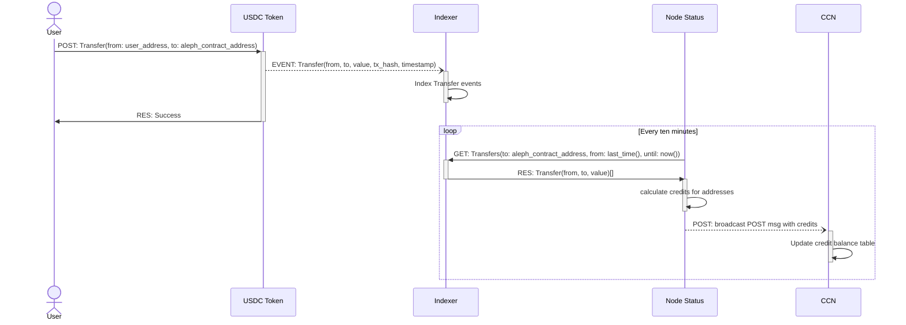
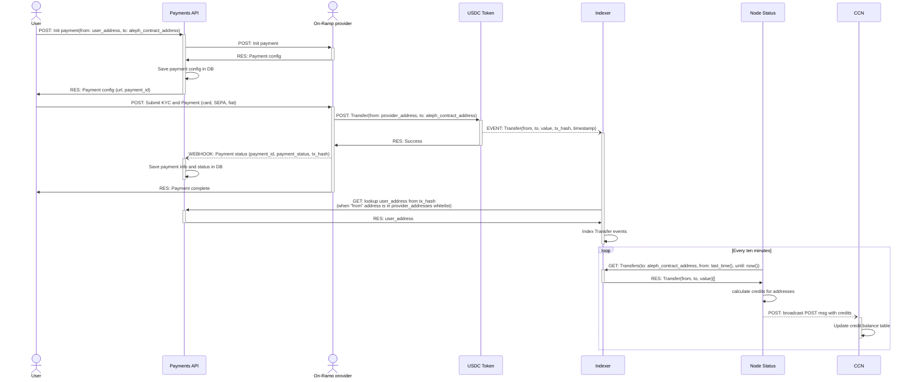
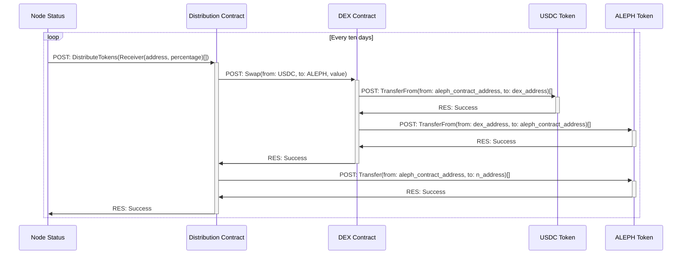

# 1. Objective

This document outlines a proposal to improve and extend Aleph’s decentralized payment infrastructure by integrating fiat on-ramp providers into our platform via a unified Payment API, indexing on-chain token transfers, and enabling automated credit calculation and token redistribution through smart contracts and scheduled processes.

# 2. Scope of Improvement

The scope includes:

- Creating a Payment API to manage interactions with fiat on-ramp providers.
- Implementing a robust Indexer to monitor ERC-20 Transfer events (USDC).
- Enhancing the Node Status Server to process credit calculations based on indexed transfers.
- Introducing a Smart Contract Distribution System that:
- Swaps accumulated USDC to ALEPH tokens.
- Redistributes ALEPH to predefined reward pools.

# 3. Architecture Overview

The architecture is composed of the following core components:

## 3.1 Payment API

- Handles initiation of payments via third-party fiat on-ramp providers.
- Listens to provider webhooks for status updates and transaction hashes.
- Performs reverse address resolution using provider APIs to associate on-chain transfers with user identities.
- Persists all payment metadata and statuses in a relational DB.

## 3.2 Indexer

- Subscribes to ERC-20 Transfer events of the USDC token.
- Indexes transactions targeting the Aleph contract.
- Coordinates with the Payment API to enrich on-chain data with user identities (for fiat-initiated transfers).
- Stores enriched event logs in a local DB.

## 3.3 Node Status Server

- Periodically queries the indexer for newly recorded USDC transfers.
- Computes equivalent Aleph credits for user addresses.
- Broadcasts credit balances to the network through a standardized POST message.

## 3.4 Distribution Contract

- Every 10 days (or on-demand), the Node Status Server triggers a distribution function.
- The contract swaps USDC → ALEPH via a DEX.
- ALEPH is then distributed to various pools (community, devs, rewards, burn, etc.) based on predefined percentages.

# 4. Sequence Flows

## 4.1 User Buys Credits via Direct USDC Transfer

### Key Notes:

- Fully on-chain user flow.
- Credits are calculated based on incoming USDC transfers directly from the user wallet.

## 4.2 User Buys Credits via Fiat On-Ramp

### Key Notes:

- Off-chain-to-on-chain flow.
- The Payment API bridges identity resolution and payment statuses.
- Credit assignment requires coordination between on-chain events and off-chain data.

## 4.3 Distribution of ALEPH Tokens

### Key Notes:

- The Node Status Server initiates token distribution every 10 days.
- The smart contract autonomously swaps and redistributes tokens based on fixed percentages.

# 5. Implementation Plan

| Component                       | Description                                                                                                                                                      | Status      | Technical Considerations                                                                                                              | Next Steps                                                                                          |
| ------------------------------- | ---------------------------------------------------------------------------------------------------------------------------------------------------------------- | ----------- | ------------------------------------------------------------------------------------------------------------------------------------- | --------------------------------------------------------------------------------------------------- |
| **Payment API**                 | A centralized API layer to integrate multiple fiat on-ramp providers. Handles initiation, webhook reception, address resolution, and stores all payment data.    | Planned     | - RESTful design - Webhook authentication - Provider-agnostic schema - Address mapping based on tx\_hash lookup              | - Finalize provider integration contracts - Define DB schema - Implement webhook verification |
| **Payment DB**                  | Stores payment metadata, statuses, KYC links, tx hashes, and user addresses.                                                                                     | Planned     | - Relational DB (PostgreSQL) - Index on `payment_id`, `tx_hash` - Foreign key relations for audit history                       | - Define schema migrations - Implement query layer and indexing                                  |
| **Indexer**                     | A backend service that listens to USDC `Transfer` events from the blockchain. Tags known providers and resolves user addresses when needed.                      | Planned     | - JSON-RPC / WebSocket-based event subscription - Provider whitelist filtering - Retry/resync strategy - Event deduplication | - Complete provider address whitelisting - Implement enrichment pipeline via Payment API         |
| **Event DB**                    | Stores all `Transfer` events (with enrichment metadata) that are directed to the Aleph contract.                                                                 | Planned     | - Partitioned by block timestamp - Indexed by `to_address`, `from_address`, `tx_hash`                                              | - Normalize structure with user metadata - Add archival mechanism                                |
| **Node Status Server**          | Periodically polls the indexer to retrieve new transfers, calculates Aleph credit balances based on USDC transferred, and broadcasts results to the CCN network. | Planned     | - Efficient polling intervals - Idempotent computation - Stable broadcast mechanism                                             | - Finalize polling logic - Validate output format with CCN - Add unit tests                   |
| **Credit Balance DB**           | Stores latest computed Aleph credits for all user addresses, updated every 10 minutes.                                                                           | Planned     | - Write-heavy with low-latency read requirements - TTL or versioned historical balance tracking                                    | - Connect with CCN updates - Monitor drift or inconsistencies                                    |
| **Smart Distribution Contract** | On-chain contract that receives the USDC tokens, swaps them for ALEPH via a DEX, and redistributes tokens to multiple reward pools.                              | Planned     | - Modular & upgradeable - Configurable recipient list and percentages - Uses on-chain DEX (e.g., Uniswap V3 interface)          | - Draft initial Solidity contract - Define reward pool logic - Setup testnet deployment       |
| **DEX Integration**             | Interface with a decentralized exchange to perform USDC → ALEPH swaps.                                                                                           | Planned     | - Use existing on-chain routers - Ensure slippage limits - Multi-step swap path support                                         | - Research optimal DEXs with deep USDC/ALEPH liquidity - Simulate swap operations                |
| **Distribution Trigger**        | Functionality in the Node Status Server that signs and initiates `DistributeTokens()` every 10 days via a configured wallet.                                     | Planned     | - Scheduled cronjob - Secure key handling (signing wallet) - Retry on failure                                                   | - Implement signing flow - Add monitoring for execution status                                   |

# 6. Considerations

- __Security__: Webhook endpoints must validate authenticity; smart contracts must be audited.
- __Scalability__: Indexer and payment resolution should support concurrent, large-volume transactions.
- __Compliance__: Ensure provider integrations meet regional KYC/AML standards.
- __Transparency__: All transactions and distributions are recorded and auditable on-chain.

# 7. Future Improvements

- Integrate L2 payment providers (e.g., Base, Arbitrum).
- Expand support to additional tokens (e.g., stablecoins beyond USDC).
- Enable multi-chain token routing and bridging.
- Integrate analytics and monitoring dashboards.

# 8. Conclusion

This proposal aims to create a seamless bridge between fiat and Web3, providing users with multiple payment options while preserving transparency, decentralization, and automation. It aligns with Aleph’s mission to offer programmable financial infrastructure at scale.

# 9. Refs

- https://docs.transak.com/reference/get-order-by-order-id
- https://docs.banxa.com/reference/retrieve-a-specific-order
- https://docs.inflowpay.com/reference/getpayment